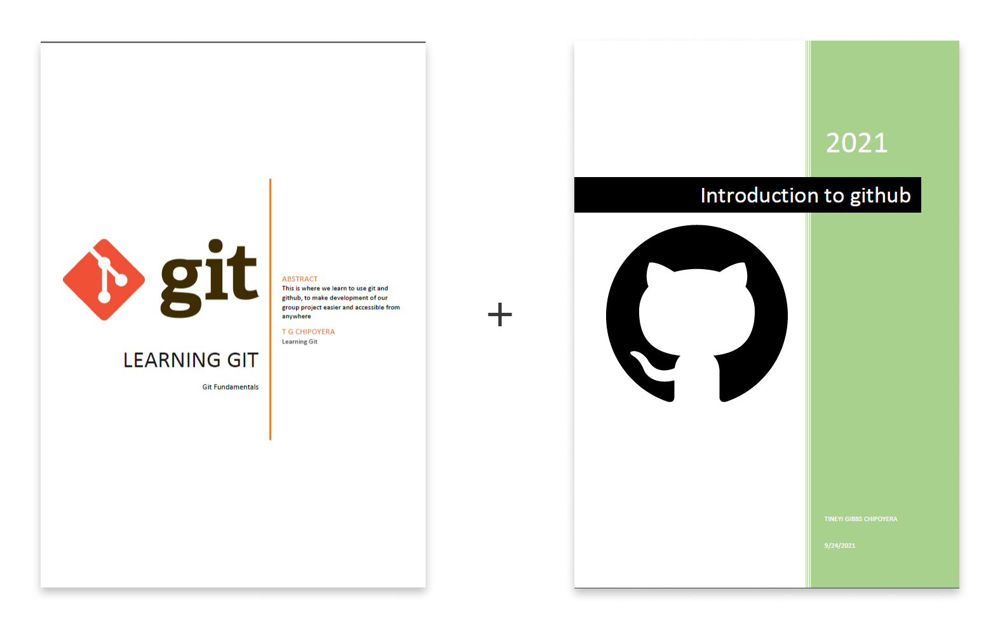

# Git & GitHub documents

## Table Of Content

- [Git \& GitHub documents](#git--github-documents)
  - [Table Of Content](#table-of-content)
  - [Introduction](#introduction)
  - [Learning Git](#learning-git)
    - [Part 1](#part-1)
    - [Part 2](#part-2)
    - [Part 3](#part-3)
  - [Introduction to GitHub](#introduction-to-github)

## Introduction

These documents were meant for Informatics 1B my group members when we did our [group assignment](https://github.com/ThaBeanBoy/GroupPrac). Due to the coronavirus, we were not able to meet up and collaborate. I suggested using GitHub since it solved 2 issues. It was easier for us to use it for collaboration & merging each other's code (This was way better than transferring the project folder over Whatsapp) & Some of us were not on Campus, so there was no need to physically meet.

## Learning Git

### Part 1

This [document](./Git%20Intro.pdf) broke down the basics of git. For demonstration purposes, I used .NET Visual Basic since this is what we used for all the practical assignments in semesters 1 & 2 of 2021.

### Part 2

Part 2 explained how to use Git. To make it easier for my group members, I demonstrated the use of Git through the Git Graphical User Interface instead of the Command Line Interface.

It goes over what a repo is, the different branches & how each branch is made up of commits. We go over how to stage unstaged files & how to commit along with a commit message.

It went through how to visualise the history of a branch & all the changes made to files within that commit.

### Part 3

Part 3 goes into how branches are made, and how to check out those branches (go into the branch). It talks about how to merge different branches. I didn't go over what happens when there are merge errors. My reasoning was that it would've overwhelmed my group members & in the event of a merge error, I would resolve it. Luckily there weren't any merge errors.

## Introduction to GitHub
